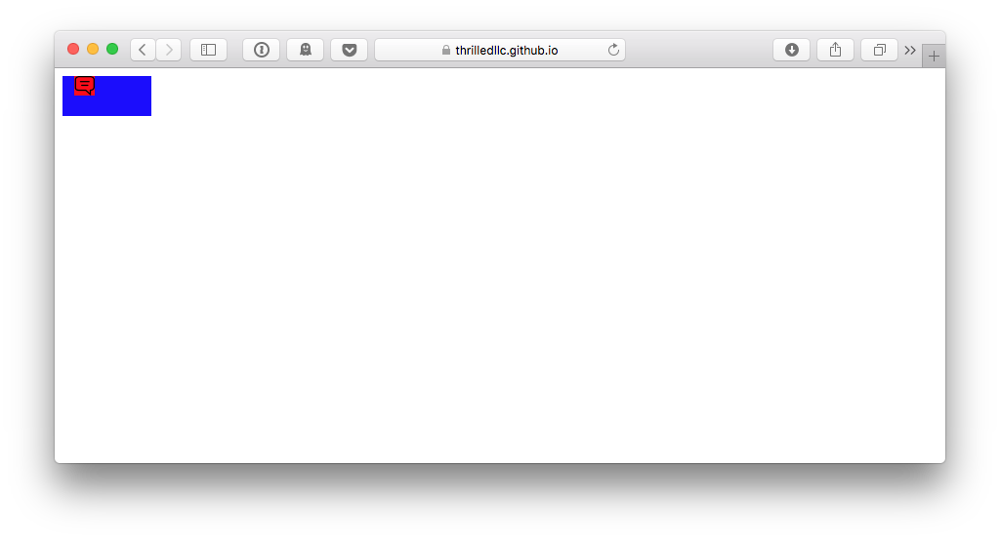
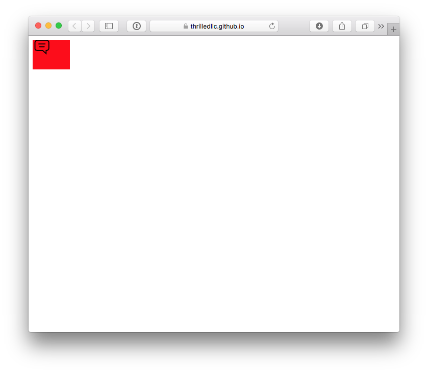
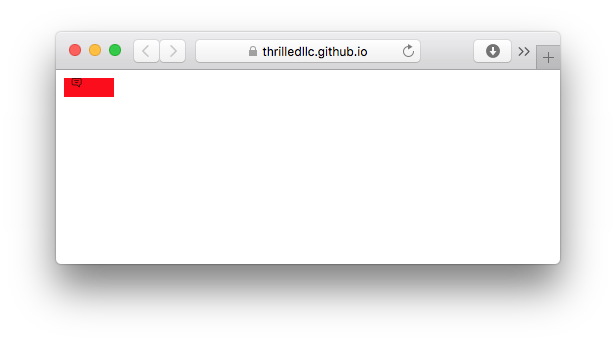

# safari-svg-bug-example

Test case url: [https://thrilledllc.github.io/safari-svg-bug-example/](https://thrilledllc.github.io/safari-svg-bug-example/)

Two issues occur with this reduced test case:

1! At small window sizes, a blue background sometimes appears. This is not defined anywhere in the markup nor in the user styles. Resizing the window makes the issue disappear.

Two examples:

2! SVG does not resize correctly while repeatedly resizing the window. 

Example, start with:

Resize to 

Reload the window to get the SVG element scaled correctly:

